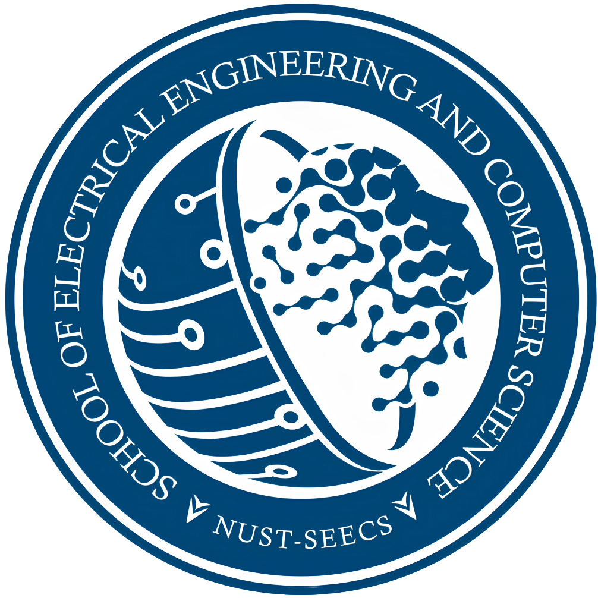

   &nbsp;&nbsp;&nbsp;&nbsp; 

# NUST – EE Repository

This repository hosts a comprehensive collection of coursework materials from six out of eight (and continuously growing) semesters pursued under the **Bachelor of Engineering** program at the esteemed <a href="https://seecs.nust.edu.pk/"> NUST School of Electrical Engineering and Computer Science (NUST – SEECS)</a>. The repository aims to provide a valuable resource for students and enthusiasts seeking to delve into the intricacies of electrical engineering concepts and applications.

## Layout 📑

The repository is structured to facilitate easy navigation and access to specific course materials. Each semester's coursework is organized into a dedicated subdirectory, further divided into individual course folders. Within each course folder, you'll find relevant assignments, projects, presentations, and supplementary learning materials.

## Contributions 📖

We encourage contributions from fellow students and electrical engineering enthusiasts to expand the repository's scope and enhance its value. _If you possess coursework materials from semesters not currently included, please consider submitting a pull request to integrate them into the repository. Your contributions will enrich the learning experience for others._

## Acknowledgements ❤️

We express our sincere gratitude to the instructors and professors at NUST – SEECS for their invaluable guidance and mentorship throughout our academic journey. Their expertise and dedication have been instrumental in shaping our understanding of electrical engineering principles.

We also extend our appreciation to the NUST – SEECS community for fostering a collaborative and supportive learning environment. The exchange of ideas and knowledge among fellow students has been a crucial aspect of our academic growth.

This repository is dedicated to the advancement of electrical engineering education and the pursuit of excellence in the field. We hope it serves as a valuable resource for students, researchers, and enthusiasts alike.

## Contact ✉️

If there is any issue on the distribution of coursework materials, you may reach out to me at [thisismumer@gmail.com](mailto:thisismumer@gmail.com?Subject=Hello%20User).
